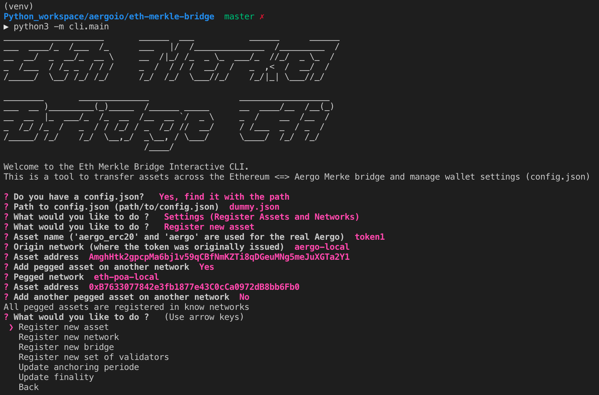

Using the EthAergo CLI
======================
CLI for the proposer/validator
------------------------------
Start the cli:

.. code-block:: bash

    $ python3 -m cli.main

The first step is to create a config file or load an existing one

Then the main menu appears with cli functionalty:

.. image:: images/step1.png

These are the settings available from the cli

Creating a config file from scratch
^^^^^^^^^^^^^^^^^^^^^^^^^^^^^^^^^^^

.. image:: images/scratch.png

Registering a new bridge
^^^^^^^^^^^^^^^^^^^^^^^^

Updating bridge settings
^^^^^^^^^^^^^^^^^^^^^^^^

.. image:: images/t_anchor_update.png

If the new anchoring periode reached validator consensus, 
it can then be automatically updated in the bridge contract by the proposer.

.. image:: images/t_anchor_update_log.png

CLI for asset transfers
-----------------------

Registering a new asset in config file
^^^^^^^^^^^^^^^^^^^^^^^^^^^^^^^^^^^^^^

Transfering a registered asset
^^^^^^^^^^^^^^^^^^^^^^^^^^^^^^

