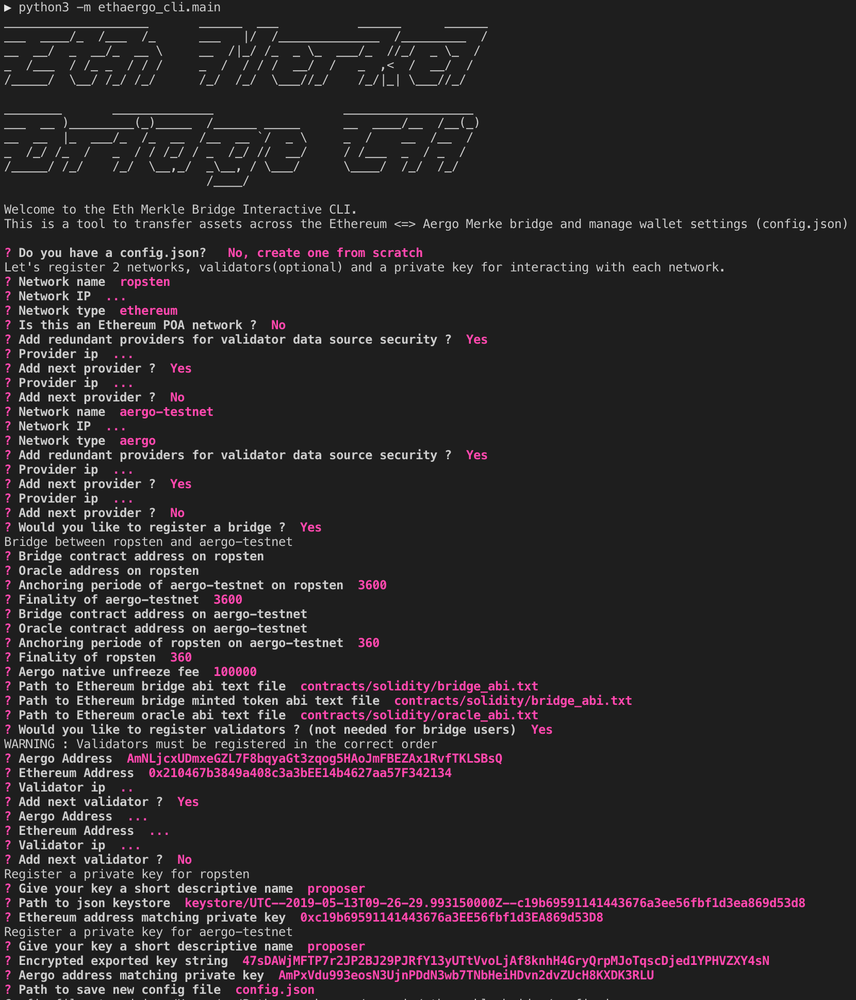
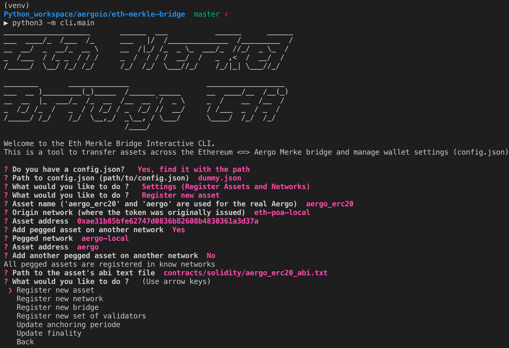

Deploying a new bridge
======================

Before using the bridge deployer, a config file should be create to register network node connections, 
validators and the address of aergo_erc20 on ethereum. The aergo bridge contract must record the aergo_erc20 address
so that aergo can be unfroozen.

.. code-block:: bash

    $ python3 -m ethaergo_bridge_operator.bridge_deployer --help                                                                                                                                                                           18h17m ⚑ ◒  
        usage: bridge_deployer.py [-h] -c CONFIG_FILE_PATH -a AERGO -e ETH
                                  --t_anchor_eth T_ANCHOR_ETH --t_final_eth
                                  T_FINAL_ETH --t_anchor_aergo T_ANCHOR_AERGO
                                  --t_final_aergo T_FINAL_AERGO
                                  [--privkey_name PRIVKEY_NAME]

        Deploy bridge contracts between Ethereum and Aergo.

        optional arguments:
        -h, --help            show this help message and exit
        -c CONFIG_FILE_PATH, --config_file_path CONFIG_FILE_PATH
                                Path to config.json
        -a AERGO, --aergo AERGO
                                Name of Aergo network in config file
        -e ETH, --eth ETH     Name of Ethereum network in config file
        --t_anchor_eth T_ANCHOR_ETH
                                Anchoring periode (in Aergo blocks) of Aergo on
                                ethereum
        --t_final_eth T_FINAL_ETH
                                Finality of Aergo (in Aergo blocks) root anchored on
                                Ethereum
        --t_anchor_aergo T_ANCHOR_AERGO
                                Anchoring periode (in Ethereum blocks) of Ethereum on
                                Aergo
        --t_final_aergo T_FINAL_AERGO
                                Finality of Ethereum (in Ethereum blocks) root
                                anchored on Aergo
        --privkey_name PRIVKEY_NAME
                                Name of account in config file to sign anchors

    $ python3 -m ethaergo_bridge_operator.bridge_deployer -c './test_config.json' -a 'aergo-local' -e eth-poa-local --t_anchor_aergo 6 --t_final_aergo 4 --t_anchor_eth 7 --t_final_eth 5 --privkey_name "proposer"

        ------ DEPLOY BRIDGE BETWEEN Aergo & Ethereum -----------
        ------ Connect AERGO -----------
        ------ Connect Web3 -----------
        aergo finality:  4
        ethereum finality:  4
        ------ Set Sender Account -----------
        Decrypt Aergo private key 'proposer'
        Password:
        > Sender Address Aergo: AmPxVdu993eosN3UjnPDdN3wb7TNbHeiHDvn2dvZUcH8KXDK3RLU
        > Sender Address Ethereum: 0xc19b69591141443676a3EE56fbf1d3EA869d53D8
        aergo validators :  ['AmNLjcxUDmxeGZL7F8bqyaGt3zqog5HAoJmFBEZAx1RvfTKLSBsQ', 'AmNLjcxUDmxeGZL7F8bqyaGt3zqog5HAoJmFBEZAx1RvfTKLSBsQ', 'AmNLjcxUDmxeGZL7F8bqyaGt3zqog5HAoJmFBEZAx1RvfTKLSBsQ']
        ethereum validators :  ['0x210467b3849a408c3a3bEE14b4627aa57F342134', '0x210467b3849a408c3a3bEE14b4627aa57F342134', '0x210467b3849a408c3a3bEE14b4627aa57F342134']
        ------ Deploy Aergo SC -----------
            > result[Cq8C52DBbfUzumGEtAZ163UQrtfuCKE2ovgawTwLk4zq] : TX_OK
        ------ Deploy Ethereum SC -----------
        > SC Address Ethereum: 0x89eD1D1C145F6bF3A7e62d2B8eB0e1Bf15Cb2374
        > SC Address Aergo: AmgQqVWX3JADRBEVkVCM4CyWdoeXuumeYGGJJxEeoAukRC26hxmw
        ------ Store bridge addresses in test_config.json  -----------

After deployment, the aer on the Aergo network should be sent (frozen) to the bridge contract so 
that it can be unfrozen when users sent their erc20 from the ethereum network.
