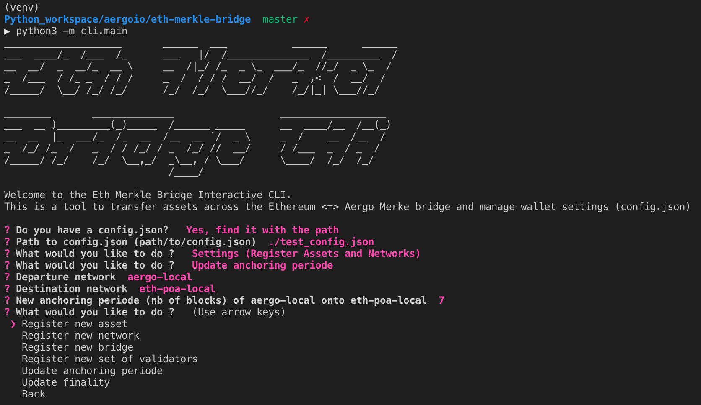
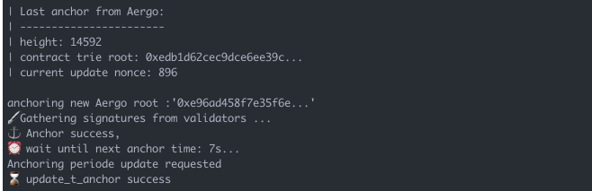

Proposer
========

A proposer connects to all validators and requests them to sign a new anchor 
with the GetEthAnchorSignature and GetAergoAnchorSignature rpc requests.
To prevent downtime, anybody can become a proposer and request signatures to validators.
It is the validator's responsibility to only sign correct anchors.
The bridge contracts will not update the state root if the anchoring time is not reached (t_anchor).

Starting a Proposer
-------------------

.. code-block:: bash

    $ python3 -m bridge_operator.proposer_client --help

        usage: proposer_client.py [-h] -c CONFIG_FILE_PATH -a AERGO -e ETH
                                  --eth_block_time ETH_BLOCK_TIME
                                  [--privkey_name PRIVKEY_NAME] [--auto_update]

        Start a proposer on Ethereum and Aergo.

        optional arguments:
        -h, --help            show this help message and exit
        -c CONFIG_FILE_PATH, --config_file_path CONFIG_FILE_PATH
                                Path to config.json
        -a AERGO, --aergo AERGO
                                Name of Aergo network in config file
        -e ETH, --eth ETH     Name of Ethereum network in config file
        --eth_block_time ETH_BLOCK_TIME
                                Average Ethereum block time
        --privkey_name PRIVKEY_NAME
                                Name of account in config file to sign anchors
        --auto_update         Update bridge contract when settings change in config
                                file

    $ python3 -m bridge_operator.proposer_client -c './test_config.json' -a 'aergo-local' -e 'eth-poa-local' --eth_block_time 3 --privkey_name "proposer" --auto_update

        ------ Connect Aergo and Ethereum -----------
        ------ Connect to Validators -----------
        Validators:  ['0x210467b3849a408c3a3bEE14b4627aa57F342134', '0x210467b3849a408c3a3bEE14b4627aa57F342134', '0x210467b3849a408c3a3bEE14b4627aa57F342134']
        aergo-local (t_final=4) -> eth-poa-local : t_anchor=7
        ------ Set Sender Account -----------
        Decrypt Ethereum keystore 'proposer'
        Password: 
        > Proposer Address: 0xc19b69591141443676a3EE56fbf1d3EA869d53D8
        ------ Connect Aergo and Ethereum -----------
        ------ Connect to Validators -----------
        Validators:  ['AmNLjcxUDmxeGZL7F8bqyaGt3zqog5HAoJmFBEZAx1RvfTKLSBsQ', 'AmNLjcxUDmxeGZL7F8bqyaGt3zqog5HAoJmFBEZAx1RvfTKLSBsQ', 'AmNLjcxUDmxeGZL7F8bqyaGt3zqog5HAoJmFBEZAx1RvfTKLSBsQ']
        aergo-local              <- eth-poa-local (t_final=4) : t_anchor=6
        ------ Set Sender Account -----------
        Decrypt exported private key 'proposer'
        Password: 
        > Proposer Address: AmPxVdu993eosN3UjnPDdN3wb7TNbHeiHDvn2dvZUcH8KXDK3RLU
        ------ START BRIDGE OPERATOR -----------

                                                | Last anchor from Ethereum:
                                                | --------------------------
                                                | height: 6124
                                                | contract trie root: 0xbd86768ec803f84995d...
                                                | current update nonce: 738

                                                anchoring new Ethereum root :'0xe7ab7124cff9217a6...'
                                                🖋 Gathering signatures from validators ...

        | Last anchor from Aergo:
        | -----------------------
        | height: 18346
        | contract trie root: 0x1a4688b925eadd45df3a...
        | current update nonce: 995

        anchoring new Aergo root :'0x1a4688b925eadd45...'
        🖋 Gathering signatures from validators ...
                                                ⚓ Anchor success,
                                                ⏰ wait until next anchor time: 18s...
        ⚓ Anchor success,
        ⏰ wait until next anchor time: 7s...

Updating bridge settings
------------------------

Bridge settings are updated when the config file changes and the proposer is started with --auto_update
The proposer will then try to gather signatures from validators to make the update on chain.

If the new anchoring periode reached validator consensus, 
it can then be automatically updated in the bridge contract by the proposer.

